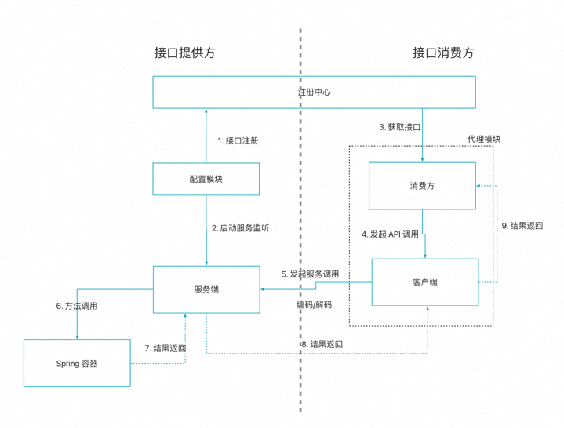

# Spring 中间件
本项目通过实现一些常见的中间件来加深对 Java 开发和 Spring 框架的理解


# 白名单拦截
白名单拦截是我们实际开发中经常遇到的业务场景：一个新功能上线后，我们通常并不会一开始就全量开放给所有用户，而是先给白名单内的用户进行开放使用，等这波用户线上验证完成后再全部开量。在这章我们实现白名单拦截的功能

## 实现思路
白名单拦截的基本实现思路是：自定义注解 + 切面 + 白名单配置
* 自定义注解：用来标记那些需要被拦截的方法。注解中需要有两个属性，第一个表示需要判断的方法参数名，第二个则是被拦截后的返回值
* 切面：用来统一处理拦截逻辑
* 白名单配置：配置白名单列表

## 实现过程
1. 先定义一个自定义注解：`WhiteListAnnotation`，里面包含方法 key，用来表示需要跟白名单进行匹配的参数
2. 然后在配置文件中添加白名单的配置，以 whitelist 作为前缀，并定义配置类：`WhiteListConfiguration`，我们使用注解 `@ConfigurationProperties(prefix = "whitelist")` 来获取配置中的值
3. 通过切面类 `WhiteListProcessAop` 来处理所有的白名单注解，处理逻辑如下：
   * 切入点是所有添加了注解 `WhiteListConfiguration` 的方法
   * 白名单开关关闭时，直接放行
   * 当前方法上没有定义 key 值，则直接放行
   * 当前方法定义了 key 值
     * key 值在白名单中，放行
     * key 值不在白名单中，返回拦截的异常


# 超时熔断
随着现在逐渐微服务化，一个功能可能上下游会依赖几十个服务，而其中如果某个服务挂了的话，那么这条链路可能就全部挂了，进而引起雪崩效应。所以为了能保证服务的高可用，我们需要有个超时熔断的机制，当某个服务不可用时能立马熔断，返回预定的错误

本章实现的超时熔断功能是在 **Netflix** 公司的开源框架 `Hystrix` 的基础上进行的封装，通过注解 + AOP 的方式，使超时熔断更加易于使用。下面简单介绍下 `Hystrix` 的原理与使用

## Hystrix 的原理与使用

`Hystrix` 工作时有以下三个状态：
* 关闭：所有请求直接通过
* 全开：当服务错误达到阈值时，进入全开状态，产生熔断，此时所有请求均降级返回
* 半开：处于全开状态下，经过阈值窗口时间后，会先处于半开状态，在本状态下，会放过一个请求，如果请求能正常返回，则后续变为关闭状态，否则回到全开状态


`Hystrix` 的使用主要有命令模式和注解模式两种。下面详细介绍命令模式的使用：

通过继承 `HystrixCommand` 来包裹实际需要调用的服务，在 `run()` 中调用服务，在 `getFallback()` 中实现降级逻辑，并且可以通过以下两种方式执行：
- execute(): 同步执行，直接返回结果，发生错误时抛异常
- queue(): 异步执行，返回一个 `Future` 对象

`HystrixCommand` 支持如下的配置： 
- GroupKey:  该命令属于哪一个组，可以帮助我们更好的组织命令。
- CommandKey: 该命令的名称
- ThreadPoolKey: 该命令所属线程池的名称，同样配置的命令会共享同一线程池，若不配置，会默认使用GroupKey作为线程池名称。
- CommandProperties: 该命令的一些设置，包括断路器的配置，隔离策略，降级设置以及一些监控指标等。
- ThreadPoolProerties: 关于线程池的配置，包括线程池大小，排队队列的大小等。

使用示例见：`HystrixDemo`

## 实现
我们最终的实现效果是通过注解的方式来方便的给当前方法添加超时熔断，可以指定超时时长，也可以使用默认的1s超时熔断。为此，我们分以下步骤实现：

1. 定义超时熔断注解：`HystrixAnnotation`，包含一个参数 timeoutMs，主要用来标记哪些方法需要超时熔断
2. 定义超时熔断处理类 `HystrixProcess`，接收切面类的方法，以及超时熔断时间，并在 run 方法中调用切面方法，完成最终方法的执行。在降级方法中返回熔断异常
3. 定义切面处理类 `HystrixProcessAop`，处理所有有超时注解的方法，实例化上述超时熔断处理类，并将当前的方法以及超时参数传入。注意：在本方法中通过 @Around("pointcut() && @annotation(hystrixAnnotation)") 来直接获取方法中的注解值

**注意点:**

在超时时长的设置中，由于同一个 key 只能设置一次，因此为了能支持对不同方法设置不同时长，我们将 "类名.方法名" 称作为 key 值传入，如下：
```
super(Setter.withGroupKey(HystrixCommandGroupKey.Factory.asKey("ExampleGroup"))
                // 通过 "类名.方法名" 来实现不同方法的超时时长的设置: String commandKey = jp.getTarget().getClass().getName() + "." + jp.getSignature().getName();
                .andCommandKey(HystrixCommandKey.Factory.asKey(commandKey))
                .andCommandPropertiesDefaults(HystrixCommandProperties.Setter()
                        .withExecutionTimeoutInMilliseconds(timeoutMs)));
```


# 服务限流
服务在线上跑的时候，一般都是有性能上限的，比如某个服务 A 最大只能应对 100 QPS 的请求，但如果此时一瞬间有大流量进来，比如有 2000 QPS 的请求进来，那么服务一下子就被打崩溃了

对于上述这种问题，我们一般采用限流的方式来解决，所以本章我们就来实现限流

## 限流算法

常见的限流算法有以下三种：
1. 计数器法
2. 漏桶算法
3. 令牌桶

**计数器法**: 计数器法限流比较简单粗暴，比如我们现在要限流 100QPS/s，那么从接收到第一个请求开始计数，每接收一个请求，计数加 1，当在 1s 内接收到 100 个请求后，后续所有的请求则全部直接丢弃，直到下一个 1s 的到来又开始重新计数
这种方式的缺点是后续的请求会被全部放弃掉，就像一个突刺一样，我们称之为突刺现象

**漏桶算法**：所有请求到来时先进入漏桶中（可以用队列实现桶），然后以指定速率从桶中获取请求来处理。虽然请求到来的时间不确定，但由于处理的速度是确定的，因此也能达到限流的目的，当然在桶装满的情况下，后续的请求也会被丢弃掉。漏桶算法可以有效的解决突刺问题，但缺点是难以应对一开始的大流量问题


**令牌桶**: 令牌桶是在桶中以固定速率放入令牌，然后服务每次先从令牌痛中获取令牌，当获取到时则服务继续运行，如果获取不到则原地等待或者直接返回异常，通过控制令牌放入桶中的速率，可以达到限流的目的。由于令牌痛一开始是装满令牌的，因此可以应对一开始的大流量问题


## 限流实现
本章实现的限流功能是基于 guava 的 `RateLimiter`限流工具的封装，它本身使用令牌桶算法，依赖包地址如下：

```xml
<dependency>
   <groupId>com.google.guava</groupId>
   <artifactId>guava</artifactId>
   <version>18.0</version>
</dependency>
```

`RateLimiter` 的使用很简单，只需要通过 create 方法创建一个实例对象，然后调用 acquire（没有令牌时原地阻塞） 或者 tryAcquire（没有令牌直接返回 false） 方法获取令牌即可，示例如下：`com.aric.middleware.RateLimiterDemo`

基于上述的 `RateLimiter`，我们现在可以封装自己的限流中间件。具体实现步骤如下：

1. 定义注解类 `RateLimiterAnnotation`，用来给需要添加限流的方法使用，同时包含一个参数 permitPerSecond 来表示具体的限流值
2. 定义限流封装类 `RateLimiterProcess`，实现核心的限流逻辑。
    - 接收切面方法来调用具体的服务
    - 维护一个 map，"类名.方法名" 作为 key，限流对象作为 value，限流参数由注解提供，最终实现针对不同方法具有不同的限流值
3. 定义切面类 `RateLimiterProcessAop`，用来拦截所有有限流注解的方法，并传入上述的限流封装类中

# 自定义拦截方法
本章我们实现自定义拦截方法，通过注解+切面的形式给用户提供更加方便的自定义逻辑的实现。

## 实现
1. 添加注解 `MethodExtAnnotation`，用来表示自定义方法的信息，其中参数 method 表示自定义的方法名称
2. 添加切面类 `MethodExtProcessAop`，处理自定义逻辑：
    * 首先从注解中获取到自定义方法的名称
    * 根据名称获取到自定义方法，这里已经假设自定义方法的参数和当前方法的参数一致：`jp.getTarget().getClass().getMethod(methodName, method.getParameterTypes());`
    * 判断方法返回时是否是 boolean，不是则抛出异常: `method.getReturnType().getName().equals("boolean")`
    * 运行方法，再根据返回值是否为 true 决定继续运行还是直接返回
3. 自定义逻辑使用如下：在运行方法 `queryUser` 时，会先运行方法 `doFilter`，当 `doFilter` 返回为 true 时，则 `queryUser` 正常返回，否则直接返回被拦截异常

```java
import com.aric.middleware.common.Result;

class MethodExtDemo {
   @MethodExtAnnotation(method = "doFilter")
   public Result queryUser(String userId) {
      return Result.success("查询用户: " + userId);
   }

   /**
    * 自定义拦截方法
    */
   public boolean doFilter(String userId) {
      if ("1234".equals(userId)) {
         logger.info("拦截自定义用户 userId：{}", userId);
         return false;
      }
      return true;
   }
}

```

# ORM 框架实现
数据库操作是我们实际业务中经常使用的，我们都用过 JDBC 的方式进行数据库操作，随着后面的学习，我们接触到了 iBatis、MyBatis，Hibernate 等优秀的数据库操作组件，这些都是 ORM 的具体实现。本章我们基于底层的 JDBC 自己封装一套 ORM 框架

## JDBC 介绍
在具体开发前，先来介绍下 JDBC 组件。JDBC 组件是数据库的驱动，提供了对数据库的 CRUD 操作。下面以一个示例来具体说明 JDBC 的使用：`com.aric.middleware.JdbcDemo`

通过上述的 CRUD 操作，我们知道使用 JDBC 对数据库进行操作主要分以下 4 步：
1. 连接到数据库：使用 "DriverManager.getConnection" 进行连接，并获取到连接对象 `Connection`
2. 预编译：我们调用 "connection.prepareStatement(sql)" 方法来对 SQL 语句执行预编译，并获取到预编译对象 `PreparedStatement`。执行预编译有很多好处，可以提高重复执行的效率，也可以防止 SQL 注入等
3. 设置参数：如果 SQL 语句中带有参数，那么这时候我们就需要设置参数，常见的方法如下，如果没有参数则不用执行
   * setInt(int parameterIndex, int x)：设置 int 类型参数
   * setString(int parameterIndex, String x)：设置 String 类型参数
   * setDouble(int parameterIndex, double x)：设置 double 类型参数
   * setDate(int parameterIndex, Date x)：设置 Date 类型参数
4. 执行 SQL 语句：有两种 API 来执行语句：
   * executeQuery()：执行查询，返回 ResultSet
   * executeUpdate()：用于执行 DML 语句（如 INSERT、UPDATE、DELETE），返回更新的行数

对于数据库执行返回的结果对象 `ResultSet` 是一个可以遍历的对象，允许我们逐行读取结果集中的数据

通常，我们先使用 next() 方法来移动到结果集中的下一行，返回 true 如果有下一行，返回 false 如果到达结果集的末尾

然后我们使用下面的 API 来访问列数据：
* getString(int columnIndex)：根据列的索引获取字符串类型的数据。
* getInt(String columnName)：根据列名获取整型数据。
* getDouble(int columnIndex)：根据列索引获取双精度浮点数。
* getDate(String columnLabel)：根据列名获取日期数据。

## ORM 整体设计

整个 ORM 框架需要包含以下几部分：
* xml 配置文件的解析，节点信息的保存
* 数据库的连接操作
* SQL 语句的解析执行和结果映射

上述功能中数据库的连接，SQL 语句的解析和执行我们使用 JDBC 的 API 实现，其余部分都需要我们自己实现。我们根据上述的功能进行合理划分，得到下面的类和接口：
* `Resource`、`XNode` 和 `Configuration`：分别表示资源类、xml 的节点类以及配置类
* `SqlSession` 和 `DefaultSqlSession`：接口和实现类，用来实现 SQL 的解析、执行和结果映射
* `SqlSessionFactory` 和 `DefaultSqlSessionFactory`：接口和实现类，用来实现数据库的连接操作
* `SqlSessionFactoryBuilder`：实现读取配置，解析并构造需要的类

### 类整体设计


### 关键步骤的实现
**xml 配置文件读取**

我们通过 `Resource` 类来实现资源的读取，具体是通过 `ClassLoader` 来加载字节流 `InputStream`，然后再转换为方便读取的字符流 `InputStreamReader`，如下:
```java
// 通过 ClassLoader 加载字节流
InputStream inputStream = classLoader.getResourceAsStream(resource);

// 字节流转换为字符流
Reader reader = new InputStreamReader(inputStream);
```

**xml 配置文件解析**

我们借助工具 dom4j 来实现对 xml 文件的解析：
1. 先从上一步中获取到的字符流 `Reader` 创建对象 `SAXReader`
2. 创建文档对象 `Document`
3. 从文档对象获取到根节点 `Element`
4. 在根节点上获取我们感兴趣的节点，使用方法 "selectNodes(nodeName)" 即可，我们也可以在节点名前增加 "//" 来直接选择子孙节点: "selectNodes("//nodeName")"
5. 通过 "content()" 方法获取到当前节点的所有子节点
6. 通过 "attributeValue(name)" 获取当前节点的属性

```java
import javax.swing.text.Element;

Reader reader = Resources.getResourceAsReader(resource);

SAXReader saxReader = new SAXReader();

Document document = saxReader.read(new InputSource(reader));

Element root = document.getRootElement();

List<Element> nodes = root.selectNodes("mappers");

List nodeChildren = nodes.get(0).content();

String id = (Element)(nodeChildren.get(0)).attributeValue("id");

String text = (Element)(nodeChildren.get(0)).getText(); // 获取节点的 text 内容
```

**XNode 节点的解析**

XNode 节点存储了我们需要的所有的 SQL 相关的信息，包括 sql 语句，输入参数，输出类型等，一个实际的例子如下：
```xml
 <select id="queryUserInfoById" parameterType="java.lang.Long" resultType="com.aric.middleware.mybatis.po.User">
     SELECT id, userId, userNickName, userHead, userPassword, createTime
     FROM user
     where id = #{id}
 </select>
```

为了存储上述的信息，XNode 类中定义了如下属性：
* String namespace: 命名空间，用来区分不同的配置文件
* String id: 当前 sql 语句的唯一标识，结合上述的 namespace，可以作为全局唯一标识: "namespace.id"
* String parameterType: 表示参数类型，一般如果只有一个参数，则可以直接使用简单对象 Long、String 等，如果 sql 中有多个参数，则使用对象或者 Map 类型的数据，存放不同的类型
* String resultType: sql 执行返回的结果类型
* String sql: 具体的 sql 语句
* Map<Integer, String> parameter: 存放 sql 中需要的参数

下面重点讲述 sql 语句的参数的解析。为了能支持参数，我们这里以特殊符号 "#{}" 来表示参数，通过正则表达式来解析出 sql 语句中的参数，并将参数名保存至 map 接口中, index 作为 map 的 key，因为在 JDBC 中参数的设置也是以 index 作为 key 值，同时当前的参数替换为 "?"，处理后，当前的 SQL 语句就是标准的 JDBC 可以解析的了。如下：
```java
public class Demo {
    public void parse() {
       String sql = node.getText();
       Map<Integer, String> parameter = new HashMap<>();
       Pattern pattern = Pattern.compile("(#\\{(.*?)\\})");
       Matcher matcher = pattern.match(sql);
       for (int i = 1; matcher.find(); i++) {
          String g1 = matcher.group(1);
          String g2 = matcher.group(2);
          // 保存参数到 map 中, 其中 i 作为 key，这样可以和 jdbc 中的 sql 参数一一对应
          parameter.put(i, g2);

          // 将自定义的参数类型 #{id} 替换为 JDBC 能处理的类型 ?
          sql = sql.replace(g1, "?");
       }
    }
}
```

**DefaultSqlSession 中的 buildParameter(PreparedStatement preparedStatement, Object parameter, Map<Integer, String> parameterMap) 实现**

"buildParameter" 方法是用来完成 SQL 中变量的替换的。实现方式也比较简单：
1. 如果输入对象 parameter 是普通的对象：Short、Integer、Long、String、Date，则直接调用 PreparedStatement 对象的 setShort、setLong 等方法进行参数替换
2. 如果输入对象 parameter 是复杂对象是，先利用反射获取到输入对象的所有字段的值，并保存到 map 中。注意：在获取字段值时，需要先调用 field.setAccessible(true) 将字段设置为公共
3. 然后遍历参数列表 parameterMap，根据参数名从上述的 map 中获取到对应的参数值，然后再根据参数值的类型去调用第一步中的对应 API 进行参数的替换

至此就完成了对 SQL 参数的替换

**DefaultSqlSession 中的 resultSet2Obj(ResultSet resultSet, Class<?> clazz) 实现**

"resultSet2Obj" 方法是将数据库查询结果转换为我们需要的对象类型。核心是遍历查询结果集，通过反射的方式将数据库中的结果映射到对象中，具体实现如下：
1. 先获取数据库结果的相关信息 `ResultSetMetaData`，从中获取到返回的列数量等信息
2. 从结果集 resultSet 中获取到当前列的值，并且通过列名拼接出对应对象的方法名，比如列名称为 "id"，则拼接出对象的方法名 "setId"
3. 根据上述的方法名，从对象上获取到实际的方法，然后调用方法实现值的设置，如下：
   ```
   // 获取数据库结果信息
   ResultSetMetaData metaData = resultSet.getMetaData();
   
   // 创建一个对象
   (T) obj = (T) clazz.newInstance();
   
   // 获取到数据库列名
   String columnName = metaData.getColumnName(i);

   // 获取到当前数据库列的值
   Object value = resultSet.getObject(i);
   
   // 拼接方法名
   String methodName = "set" + columnName.substring(0, 1).toUpperCase() + columnName.substring(1); 
   
   // 通过反射获取到方法
   if (value instanceof Timestamp) {
     Method method = clazz.getMethod(methodName, Date.class); 
   } else {
     Method method = clazz.getMethod(methodName, value.getClass()); 
   }
   
   // 调用方法设置值
   method.invoke(obj, value);
   ```

# ORM 框架与 Spring 的结合
在上一章我们实现了一个 ORM 框架，能进行基本的 CRUD 操作以及完成参数和结果的映射。这一章我们需要将它集成到 Spring 框架中便于使用。同时我们知道在 mybatis 框架提供了一种快捷方便的方式操作数据库，即只提供接口定义，不需要具体的实现类就可以实现数据库的操作，示例如下：

```java
import org.springframework.stereotype.Component;

// 定义数据库操作接口
@Component
public interface IUserDao {
   User queryUserInfoById(Long id);
}

// 直接通过接口进行数据库的操作
@Test
public void test() {
   BeanFactory beanFactory = new ClassPathXmlApplicationContext("spring-config.xml");
   IUserDao userDao = beanFactory.getBean("IUserDao", IUserDao.class);
   User user = userDao.queryUserInfoById(1L);
   logger.info("测试结果：{}", JSON.toJSONString(user));
}
```

上述例子中展示了在 mybatis 中是如何只通过一个接口，就可以进行数据库操作的方式。这个实现其实也不复杂，mybatis 框架会给这些接口都创建一个代理类，对这些接口的操作其实就是对代理类的操作，而在代理类中会调用具体的 ORM 框架去操作数据库

下面我们来实现 mybatis 的这种功能。让我们的 ORM 框架更像 mybatis

## 整体设计
上文说到了接口操作的核心是代理类，所以我们首先需要一个配置扫描类，用来扫描所有需要代理的接口，并给这些接口添加代理类，其次需要一个代理类，用来代理接口的操作，最后我们还需要一个 ORM 操作类，在代理类中我们借助 ORM 操作类来实际操作 ORM 框架

综上，mybatis-spring 框架的核心类有如下三个：
1. `MapperScannerConfigurer`：配置扫描类，通过扫描指定路径下的所有接口，并为接口添加代理类
2. `MapperFactoryBean`：接口的代理类，借助 ORM 操作类来实际操作 ORM
3. `SqlSessionFactoryBean`：完成 `SqlSessionFactory` 类的初始化，并操作 ORM

完整过程如下：
我们首先通过 Spring 配置文件，将 `MapperScannerConfigurer` 和 `SqlSessionFactoryBean` 注册到 Spring 容器中，然后在 Bean 注册的时候，`MapperScannerConfigurer` 进行自定义的扫描注册 Bean，将所有需要的接口都设置代理类 `MapperFactoryBean`，而在 `MapperFactoryBean` 中会调用 `SqlSessionFactoryBean` 来进行 ORM 操作，这样就完成了 mybatis 集成到 Spring 的过程。


## 核心实现
### `SqlSessionFactoryBean` 类的实现
`SqlSessionFactoryBean` 类是完成 `SqlSessionFactory` 类的初始化，并借此用来操作 ORM 的。我们通过实现 Spring 中的 FactoryBean 和 InitializingBean 这两个接口来完成该类的实例化
* FactoryBean：用来创建 Spring 容器中的实例对象。我们在这个接口中完成了当前实例对象指向 `SqlSessionFactory` 对象
* InitializingBean：在 Bean 对象配置完属性后的钩子操作。我们在这个接口中完成了 `SqlSessionFactory` 的实例化


### `MapperFactoryBean` 类的实现
`MapperFactoryBean` 类是接口代理类，主要是代理 mybatis 的接口，并实现 ORM 操作。这里我们还是通过实现 FactoryBean 接口来完成类的实例化，并在其中完成代理类的创建。
创建所需的被代理的接口以及 ORM 操作对象会在构造函数中注入，这个是由扫描类帮忙注入的。代理的实现逻辑也比较简单：
1. 根据当前被代理的方法，获取到方法名，和接口全名进行拼接后，就得到了完整的操作名，即上一章的 "namespace.id"
2. 根据方法是否有变量、返回是否是列表来决定选择需要的 ORM 的方法，即最终调用 SqlSession.selectOne 还是 SqlSession.selectList 

代码实现如下：
```java
@Override
public T getObject() throws Exception {
  InvocationHandler handler = (proxy, method, args) -> {
      System.out.println("你被代理了，执行SQL操作: " + method.getName());
      // 获取全限定名
      String statement = mapperInterface.getName() + "." + method.getName();

      // 开启 ORM 操作
      SqlSession sqlSession = sqlSessionFactory.openSession();

      // 根据返回值和参数类型选择调用的 ORM 的 API
      Class<?> returnType = method.getReturnType();
      try {
          // 无参数
          if (null == args || args.length == 0) {
              // 返回列表
              if (List.class.isAssignableFrom(returnType)) {
                  return sqlSession.selectList(statement);
              } else { // 返回单个对象
                  return sqlSession.selectOne(statement);
              }
          } else { // 有参
              // 返回列表
              if (List.class.isAssignableFrom(returnType)) {
                  return sqlSession.selectList(statement, args[0]);
              } else { // 返回单个对象
                  return sqlSession.selectOne(statement, args[0]);
              }
          }
      } finally {
          sqlSession.close();
      }
  };

  return (T) Proxy.newProxyInstance(Thread.currentThread().getContextClassLoader(), new Class[]{mapperInterface}, handler);
}
```

### `MapperScannerConfigurer` 类的实现
`MapperScannerConfigurer` 是配置扫描类，用来解析配置，扫描出所有需要代理的 DAO 接口，修改 Bean 注册并添加上述的代理类，最终注册到 Spring 容器中。
注意：在给接口添加代理的时候，还需要将当前接口，以及 ORM 操作对象 `SqlSessionFactory` 注入到代理类中的构造函数的参数中

要自定义 Bean 的注册，我们需要实现 BeanDefinitionRegistryPostProcessor 接口，一个简单的例子如下，其中还包括添加构造函数的参数：
```java
// 定义一个简单的 Bean 类
public class CustomBean {
   private String name;
   private Integer age;

   public CustomBean(String name, Integer age) {
      this.name = name;
      this.age = age;
   }

   public void sayHello() {
      System.out.println("hello world: " + name + ":" + age);
   }
}

// 实现 BeanDefinitionRegistryPostProcessor
@Component
public class CustomBeanDefinitionRegistryPostProcessor implements BeanDefinitionRegistryPostProcessor {

   @Override
   public void postProcessBeanDefinitionRegistry(BeanDefinitionRegistry registry) throws BeansException {
      // 创建 BeanDefinition
      BeanDefinition beanDefinition = BeanDefinitionBuilder
              .genericBeanDefinition(CustomBean.class)
              .getBeanDefinition();
   
      // 添加构造函数的参数
      beanDefinition.getConstructorArgumentValues().addGenericArgumentValue("xiaoming");
      beanDefinition.getConstructorArgumentValues().addGenericArgumentValue(18);
   
      registry.registerBeanDefinition("customBean", beanDefinition);
   }

    @Override
    public void postProcessBeanFactory(ConfigurableListableBeanFactory beanFactory) throws BeansException {
        // 这个方法可以不实现
    }
}
```
上面的例子展示了如何自定义注册 Bean，接下来就是实现路径的扫描，并批量自定义注册 Bean。完整的实现过程如下：
1. 首先我们使用 `PathMatchingResourcePatternResolver` 类来扫描类路径，它可以支持复杂路径的扫描
2. 然后我们通过 `MetadataReader` 接口获取到类的元数据。它是 Spring 中用于读取和访问类的元数据信息的接口，是核心组件之一，可以在不加载类的情况下直接通过字节码获取到类的元数据，性能比较高
3. 将上述步骤中读取到的元数据对象通过 `ScannedGenericBeanDefinition` 来加载出 BeanDefinition 对象
4. 设置 BeanDefinition 的属性，包括设置构造参数等，供后续代理类使用，同时设置 beanClass 为我们的代理类 MapperFactoryBean
5. 最后我们注册 BeanDefinition

# 开发 ORM starter
上面两章中我们开发了 ORM，并且将 ORM 集合到 Spring 框架中，但现在使用上还是比较繁琐，不仅要添加配置文件，还需要实例化 Bean 对象，初始化 `SqlSessionFactory` 等，所以在本章我们开发一个 Spring boot starter 插件，将上述的步骤自动化装配，这样后面使用的时候，就直接在 pom 中引入我们的 starter 依赖即可开箱使用

在实际开发本章的 starter 前，先来介绍下 starter 以及它的开发流程。

## 关于 Starter
在传统的 Spring 框架使用中，我们要引入一个中间件，比如 Redis、Mybatis，需要做一系列的配置操作，以及 Bean 对象初始化等操作，引入的中间件一多，就成了配置地狱。所以为了解决这种配置繁琐的问题，官方推出了 Spring Boot，它秉承着约定大于配置的理念，通过一个个的 starter 让我们实现开箱即用，比如我们只需要在 pom 依赖中添加 spring-boot-starter-web，我们就可以使用 Spring MVC 的功能。

而 starter 其实就是内部封装了所需的所有依赖，默认的配置，并帮我们自动初始化 Bean 对象，然后通过 spring.factories 文件来告诉 Spring 框架自动装配的路径，在 Spring 框架启动的时候运行我们的 starter 完成自动装配。一句话就是 starter 帮我们做了所有的脏活累活，所以我们才能优雅的使用

## 开发一个 Starter 示例
开发一个 Starter 其实很简单，主要有以下 4 个步骤：
1. 创建一个 maven 项目，并在 pom 文件中添加需要的依赖
2. 创建一个配置类，用来保存配置。添加 @ConfigurationProperties 注解，读取配置，并且需要增加一个前缀，该前缀下的都是我们的配置。类本身包含默认配置，当然外部项目可以通过修改配置文件来覆盖默认配置
   ```java
   @ConfigurationProperties(prefix = "test")
   public class MyProperties {
        // 自动获取配置文件中前缀为test的属性，把值传入对象参数
        private String name = "hello";
   
        public String getName() {
            return name;
        }
    
        public void setName(String name) {
            this.name = name;
        }
   } 
   ```
3. 创建一个自动装配类，完成 Bean 对象的实例化。添加 @Configuration 注解，表示是一个配置类，添加 @EnableConfigurationProperties 注解，使上述的配置类生效。我们在实例化 Bean 方法上添加 @ConditionalOnMissingBean 注解，表示只有当前 Bean 不存在的时候，才去实例化，防止重复实例化
   ```java
   @Configuration
   @EnableConfigurationProperties(MyProperties.class)
   public class TestAutoConfiguration {
   
       @Resource
       private MyProperties properties;
   
       /**
        * 在Spring上下文中创建一个对象
        */
       @Bean
       @ConditionalOnMissingBean
       public TestService init(){
           TestService testService = new TestService();
           String name = properties.getName();
           testService.setName(name);
           return testService;
       }
   }
   ```
4. 我们在 resources 文件夹下新建目录 META-INF，在目录中新建 spring.factories 文件，并添加自动装配类的路径到 spring.factories 文件中。告诉 Spring 框架自动装配类的路径，在启动的时候自动执行我们的自动装配类来完成 Bean 对象的实例化
   ```
   org.springframework.boot.autoconfigure.EnableAutoConfiguration=com.shgx.starter.TestAutoConfiguration
   ```
完成上述 4 步后，直接打包就得到了一个自定义的 Starter

## mybatis-spring-boot-starter
接下来开发我们自己的 ORM starter：mybatis-spring-boot-starter

其实 starter 要做的事情就是上一章中将 ORM 集成到 Spring 所要做的事情，包括实例化对象 `SqlSessionFactory`，以及通过 `MapperScannerConfigurer` 类来扫描接口并添加接口类。我们这里复用上一章中集成的那些类，同时因为配置从 xml 改为 yaml，所以这些类的参数有一些修改。

首先，我们定义一个配置类 `MybatisProperties`，用来保存配置信息。我们 starter 的配置如下，可以看到原先通过 xml 配置的现在都改为 yaml 配置，同时这些配置在引入的项目中可以被覆盖
```yaml
mybatis:
  driver: com.mysql.jdbc.Driver
  url: jdbc:mysql://127.0.0.1:3306/demo?useUnicode=true
  username: root
  password: 
  mapper-locations: classpath*:mapper/*.xml
  base-package: com.aric.middleware.mybatis.dao
```

`MybatisProperties` 属性如下，跟上述的配置类一一对应，我们添加 "mybatis" 作为配置类的前缀。同时需要注意配置中使用 "-" 连接的，在配置类中使用驼峰表示

有了配置类后，接下来我们需要一个自动装配类，来完成那些 Bean 的实例化，关键代码如下。
```java
@Configuration
@EnableConfigurationProperties(MybatisProperties.class)
public class MybatisAutoConfiguration {
   @Bean
   @ConditionalOnMissingBean
   public SqlSessionFactory sqlSessionFactory(MybatisProperties mybatisProperties, Connection connection) throws Exception {
      return new SqlSessionFactoryBuilder().build(connection, mybatisProperties.getMapperLocations());
   }

   public static class AutoConfiguredMapperScannerRegistrar implements EnvironmentAware, ImportBeanDefinitionRegistrar {
      private String basePackage;

      @Override
      public void registerBeanDefinitions(AnnotationMetadata importingClassMetadata, BeanDefinitionRegistry registry) {
          // 注册 MapperScannerConfigurer 类
         BeanDefinitionBuilder beanDefinitionBuilder = BeanDefinitionBuilder.genericBeanDefinition(MapperScannerConfigurer.class);
         
         beanDefinitionBuilder.addPropertyValue("basePackage", this.basePackage);
         registry.registerBeanDefinition(MapperScannerConfigurer.class.getName(), beanDefinitionBuilder.getBeanDefinition());
      }

      @Override
      public void setEnvironment(Environment environment) {
          // 通过 EnvironmentAware 来获取配置属性
         this.basePackage = environment.getProperty("mybatis.base-package");
      }
   }

   @Configuration
   @Import({AutoConfiguredMapperScannerRegistrar.class})
   public static class MapperScannerRegistrarNotFoundConfiguration {
       // 启动上述的静态类
   }
}
```
1. 我们添加 @Configuration 注解，确保当前类在 Bean 扫描路径中，添加 @EnableConfigurationProperties 注解，启用上述的配置类
2. 在类中我们创建 `SqlSessionFactory` 的 Bean 对象，用来实例化 ORM 操作对象，这个其实和上一章的 `SqlSessionFactoryBean` 一样，只不过上一章中是添加到 xml 配置中的，这里我们在配置类中自动实例化了。 需要注意的是，这里我们需要修改下 `SqlSessionFactoryBuilder` 的参数，因为之前是从 xml 中读取的，但现在我们将配置外放，并且支持后续外部用户在项目中修改配置，因此就不适合当前的内部配置的形式了，所以我们将参数修改为直接接收 `Connection` 对象，这样内部类就不需要去读取那些配置了
3. 我们添加内部静态类 `AutoConfiguredMapperScannerRegistrar`，用来注册 `MapperScannerConfigurer` 类，这个类就是用来自动扫描并添加代理类。同时需要注意的是，Bean 注册类运行比较早，这时候还没有配置类，所以我们通过 EnvironmentAware 来感知配置
4. 最后我们添加一个类 `MapperScannerRegistrarNotFoundConfiguration` 来启动上述的静态类

最后在 resources/META-INF/spring.factories 文件中添加自动配置入口即可
```
org.springframework.boot.autoconfigure.EnableAutoConfiguration=com.aric.middleware.mybatis.springbootstarter.MybatisAutoConfiguration
```

# RPC 框架通信模型实现
rpc 通信被广泛的应用在不同服务之间相互调用，它可以像调用本地方法一样去调用远程服务，使用非常的便捷。如下面示例所示，我们直接在项目 A 中去调用项目 B 的服务时，直接引入对象并调用对象的方法，看起来像是直接在本地调用一般，但其实内部还是通过网络请求调用了远程的 B 服务，只不过 rpc 框架帮我们封装了底层
```java
import jakarta.annotation.Resource;

// 工程 A
public class ProjectA {
   @Resource
   private ServiceB serviceB;
   
   public void hello() {
       serviceB.hello();
   }
}

// 工程 B 中提供了 ServiceB 的服务
public class ServiceBImpl implements ServiceB {
    @Override
    public void hello() {
       System.out.println("hello world!");
    }
}
```
**注意**: 工程 B 是部署在其他服务器上的，有他自己的数据库等资源，所以要调用 B 的服务，你只能通过网络请求比如 http 的方式去调用，这个和工程 A 中直接引入工程 B 的包是不一样的，前者是独立的服务，有独立的数据库等资源，后者只是当成工具一样引入。

## 前置知识
本次 rpc 中间件的设计需要用到自定义标签的处理技术以及 netty 通信，下面先介绍这两种技术：

### 自定义标签处理
我们需要通过自定义的标签来实现接口的注册和获取，在 spring 中实现 xml 的自定义标签的解析有以下 4 步：

1. 首先我们需要创建描述我们自定义标签属性的文件，也就是 custom.xsd 文件。如下所示：xmlns 指定了自定义命名空间。targetNamespace 设定了目标命名空间，这意味着任何符合这个 XSD 的 XML 文档都会被认为是在该命名空间内。elementFormDefault="qualified" 指定在目标命名空间中的元素必须在 XML 文档中被限定，通常使用命名空间前缀。
   创建完后需要注册下，在 META-INF/spring.schemas 中添加以下内容：http\://www.example.org/schema/custom/custom.xsd=custom.xsd
上述添加的内容表示告诉 Spring 框架，遇到 xml 中的 "http\://www.example.org/schema/custom/custom.xsd" 资源验证时，直接使用 "custom.xsd"，也就是我们刚创建的 xsd 文件
   ```xsd
   <?xml version="1.0" encoding="UTF-8"?>
   <xs:schema xmlns:xs="http://www.w3.org/2001/XMLSchema"
   xmlns="http://www.example.org/schema/custom"
   targetNamespace="http://www.example.org/schema/custom"
   elementFormDefault="qualified">
   
       <xs:element name="custom-tag">
           <xs:complexType>
               <xs:attribute name="id" type="xs:string" />
               <xs:attribute name="name" type="xs:string" />
               <xs:attribute name="age" type="xs:string" />
           </xs:complexType>
       </xs:element>
   </xs:schema>
   ```
2. 有了上述的 xsd 配置文件，并注册了 xsd 的解析路径后，接下来我们就可以创建包含自定义标签的 xml 配置文件：spring-config.xml。下面的配置文件中的 xmlns:custom 就表示我们的自定义标签头为 custom, 命名空间是 "http://www.example.org/schema/custom", 然后 xsi:schemaLocation 指定了命名空间资源验证路径，可以看到我们的命名空间 "http://www.example.org/schema/custom" 对应的验证路径是 "http://www.example.org/schema/custom/custom.xsd", 而通过上述 xsd 注册知道，该验证路径正好对应我们创建的 xsd 文件，所以最终就是通过我们创建的 xsd 文件来验证 xml 配置中的 custom-tag
   ```xml
   <beans xmlns="http://www.springframework.org/schema/beans"
   xmlns:xsi="http://www.w3.org/2001/XMLSchema-instance"
   xmlns:custom="http://www.example.org/schema/custom"
   xsi:schemaLocation="
   http://www.springframework.org/schema/beans
   http://www.springframework.org/schema/beans/spring-beans.xsd
   http://www.example.org/schema/custom
   http://www.example.org/schema/custom/custom.xsd">
   
       <custom:custom-tag id="customBean1" name="aric" age="18" />
       <custom:custom-tag id="customBean2" name="ke" age="28" />
   </beans>
   ```
3. 现在我们可以添加自定义命名空间处理类。并注册命名空间处理类：在 META-INF/spring.handlers 文件中添加内容：http\://www.example.org/schema/custom=com.example.CustomNamespaceHandler 。这个就表示上述我们自定义标签的命名空间 "http://www.example.org/schema/custom" 由下面的类来处理。
详情看 `com.aric.middleware.CustomNamespaceHandler`

4. 创建自定义的 BeanDefinitionParser, 这是负责解析自定义标签的核心类: `com.aric.middleware.CustomBeanDefinitionParser`

以上 4 步就完成了自定义标签，包括 xsd 文件描述，xsd 注册，命名空间处理类、命名空间处理注册、标签解析类。接下来我们就可以按如下方式获取到我们自定义的 Bean：详情请看 `com.aric.middleware.CustomBeanApplicationTest`

### Netty 组件
Netty 是一个高性能的异步事件驱动的网络通信框架。在详细介绍 Netty 的通信模型前，我们先介绍下 Java 中的传统的同步阻塞网络模型 BIO，如下，同步阻塞结构是每来一个请求，就会新开一个线程去处理，同时读写都是阻塞的，这种方式非常的低效，一旦请求多了，会占用大量的线程


为了解决上述的问题，所以 Java 又提出了 I/O 复用模型，也就是通过一个 Selector 来同时处理多个 IO，这样就大大提高了效率，如下，一个线程中通过 Selector（多路复用器） 可以同时处理多个 IO 请求。当其中一个 IO 处于等待状态时，线程可以去处理其他 IO，这样就能大大的提高效率了


同时，Netty 中的 IO 读取是基于 Buffer 的。传统的 IO 读取是基于字节/字符流的，这种方式不能随意改变读取位置。而 Netty 中引入了 Channel 和 Buffer 概念，数据的读取是从 Channel 中读入到 Buffer 中，或者从 Buffer 中将数据写入 Channel

#### Netty 的线程模型
Netty 主要基于主从 Reactors 多线程模型（如下图）做了一定的修改，其中主从 Reactor 多线程模型有多个 Reactor：MainReactor 和 SubReactor：


* mainReactor：负责客户端的连接请求，并将请求转交给 subReactor
* subReactor: 负责相应通道的 IO 读写请求
* 非 IO 请求：直接写入任务队列，等待 worker threads 线程处理

Netty 中的 IO 操作都是异步的，包括 bind，write，connect 等操作都会返回一个 ChannelFuture 对象，调用者并不会立刻拿到结果，通过Future-Listener机制可以得到最后的结果，如下：
```
serverBootstrap.bind(port).addListener(future -> {
  if (future.isSuccess()) {
      System.out.println(new Date() + ": 端口[" + port + "]绑定成功!");
  } else {
      System.err.println("端口[" + port + "]绑定失败!");
  }
});
```

#### Netty 工作架构


Netty server 端包含 1 个 Boss NioEventLoopGroup 和 1 个 Worker NioEventLoopGroup。NioEventLoopGroup 相当于 1 个事件循环组，这个组里包含多个事件循环 NioEventLoop，每个 NioEventLoop 包含 1 个 selector 和 1 个事件循环线程。

每个 Boss NioEventLoop 循环执行的任务包含 3 步：
1. 轮询 accept 事件
2. 处理 accept I/O 事件，与 Client 建立连接，生成 NioSocketChannel，并将 NioSocketChannel 注册到某个 Worker NioEventLoop 的 Selector 上
3. 处理任务队列中的任务，runAllTasks。任务队列中的任务包括用户调用 eventloop.execute 或 schedule 执行的任务，或者其它线程提交到该 eventloop 的任务

每个 Worker NioEventLoop 循环执行的任务包含 3 步：
1. 轮询 read、write 事件
2. 处理 I/O 事件，即 read、write 事件，在 NioSocketChannel 可读、可写事件发生时进行处理
3. 处理任务队列中的任务，runAllTasks

任务队列中的任务有 3 中典型的场景：
1. 用户程序自定义的普通任务
   ```
   ctx.channel().eventLoop().execute(new Runnable() {
      @Override
      public void run() {
         //...
      }
   });
   ```
2. 非当前 reactor 线程调用 channel 的各种方法 例如在推送系统的业务线程里面，根据用户的标识，找到对应的 channel 引用，然后调用 write 类方法向该用户推送消息，就会进入到这种场景。最终的 write 会提交到任务队列中后被异步消费
3. 用户自定义定时任务
   ```
   ctx.channel().eventLoop().schedule(new Runnable() {
   @Override
   public void run() {
   
   }
   }, 60, TimeUnit.SECONDS);
   ```

#### Netty 核心组件
##### Bootstrap、ServerBootstrap
Bootstrap 意思是引导，一个 Netty 应用通常由一个 Bootstrap 开始，主要作用是配置整个 Netty 程序，串联各个组件。Bootstrap 类是客户端程序的启动引导类，只需要一个 group，ServerBootstrap 是服务端启动引导类，需要两个 group

一般 Bootstrap 创建启动步骤如下：


**group()**

上面说到 ServerBootstrap 需要两个线程组：

```
EventLoopGroup bossGroup = new NioEventLoopGroup();
EventLoopGroup workerGroup = new NioEventLoopGroup();
```

* bossGroup 用于监听客户端连接，专门负责与客户端创建连接，并把连接注册到 workerGroup 的 Selector 中
* workerGroup 用于处理每一个连接发生的读写事件

##### Future、ChannelFuture
正如前面介绍，在 Netty 中所有的 IO 操作都是异步的，不能立刻得知消息是否被正确处理，但是可以过一会等它执行完成或者直接注册一个监听，具体的实现就是通过 Future 和 ChannelFutures，他们可以注册一个监听，当操作执行成功或失败时监听会自动触发注册的监听事件

##### Channel
Netty网络通信的组件，能够用于执行网络I/O操作。 Channel为用户提供：
* 当前网络连接的通道的状态（例如是否打开？是否已连接？）
* 网络连接的配置参数 （例如接收缓冲区大小）
* 提供异步的网络I/O操作(如建立连接，读写，绑定端口)，异步调用意味着任何I / O调用都将立即返回，并且不保证在调用结束时所请求的I / O操作已完成。调用立即返回一个ChannelFuture实例，通过注册监听器到ChannelFuture上，可以I / O操作成功、失败或取消时回调通知调用方。
* 支持关联I/O操作与对应的处理程序

不同协议、不同的阻塞类型的连接都有不同的 Channel 类型与之对应，下面是一些常用的 Channel 类型
* NioSocketChannel，异步的客户端 TCP Socket 连接
* NioServerSocketChannel，异步的服务器端 TCP Socket 连接
* NioDatagramChannel，异步的 UDP 连接
* NioSctpChannel，异步的客户端 Sctp 连接
* NioSctpServerChannel，异步的 Sctp 服务器端连接 这些通道涵盖了 UDP 和 TCP网络 IO以及文件 IO.

##### Selector
Netty基于Selector对象实现I/O多路复用，通过 Selector, 一个线程可以监听多个连接的Channel事件, 当向一个Selector中注册Channel 后，Selector 内部的机制就可以自动不断地查询(select) 这些注册的Channel是否有已就绪的I/O事件(例如可读, 可写, 网络连接完成等)，这样程序就可以很简单地使用一个线程高效地管理多个 Channel

##### NioEventLoop
NioEventLoop 中维护了一个线程和任务队列，支持异步提交执行任务，线程启动时会调用 NioEventLoop 的 run 方法，执行 I/O 任务和非 I/O 任务：
* I/O 任务 即 selectionKey 中 ready 的事件，如 accept、connect、read、write 等，由 processSelectedKeys 方法触发。
* 非 IO 任务 添加到 taskQueue 中的任务，如 register0、bind0 等任务，由 runAllTasks 方法触发

两种任务的执行时间比由变量 ioRatio 控制，默认为 50，则表示允许非 IO 任务执行的时间与 IO 任务的执行时间相等

##### NioEventLoopGroup
主要管理 eventLoop 的生命周期，可以理解为一个线程池，内部维护了一组线程，每个线程(NioEventLoop)负责处理多个 Channel 上的事件，而一个 Channel 只对应于一个线程

##### ChannelHandler
ChannelHandler 是一个接口，处理 I/O 事件或拦截 I/O 操作，并将其转发到其 ChannelPipeline(业务处理链)中的下一个处理程序

ChannelHandler 本身并没有提供很多方法，因为这个接口有许多的方法需要实现，方便使用期间，可以继承它的子类：
* ChannelInboundHandler用于处理入站 I/O 事件
* ChannelOutboundHandler用于处理出站 I/O 操作

或者使用以下适配器类：
* ChannelInboundHandlerAdapter 用于处理入站 I/O 事件
* ChannelOutboundHandlerAdapter 用于处理出站 I/O 操作
* ChannelDuplexHandler 用于处理入站和出站事件

##### ChannelHandlerContext
保存 Channel 相关的所有上下文信息，同时关联一个 ChannelHandler 对象

##### ChannelPipline
保存 ChannelHandler 的 List，用于处理或拦截 Channel 的入站事件和出站操作。 ChannelPipeline 实现了一种高级形式的拦截过滤器模式，使用户可以完全控制事件的处理方式，以及 Channel 中各个的 ChannelHandler 如何相互交互

在 Netty 中每个 Channel 都有且仅有一个 ChannelPipeline 与之对应, 它们的组成关系如下:


一个 Channel 包含了一个 ChannelPipeline, 而 ChannelPipeline 中又维护了一个由 ChannelHandlerContext 组成的双向链表, 并且每个 ChannelHandlerContext 中又关联着一个 ChannelHandler。入站事件和出站事件在一个双向链表中，入站事件会从链表head往后传递到最后一个入站的handler，出站事件会从链表tail往前传递到最前一个出站的handler，两种类型的handler互不干扰。

#### Netty 通信的例子
具体可以看 `MyNettyServer` 和 `MyNettyClient` 这两个类

#### 参考
* https://juejin.cn/post/6924528182313893896
* https://developer.aliyun.com/article/769587

## 架构设计
rpc 调用的完整流程如下：



rpc 的调用过程包含了 3 方：rpc 中间件、接口注册方、接口消费方。其中 rpc 中间件提供 rpc 的全部功能，接口注册方通过中间件注册接口，接口消费方通过中间件消费接口，上面例子中的项目 B 就是接口注册方，项目 A 就是接口消费方

由上述的调用过程可以知道，rpc 中间件至少包含了以下的模块：
* 注册中心：保存我们的接口信息
* 配置模块：注册中心的配置、接口配置
* 网络通信：编码/解码、网络通信
* 代理模块：消费方通过代理模块实现 API 调用的全过程，包括调用网络通信等


## 模块设计
### 配置模块
配置模块包括自定义标签、接口注册的配置和接口消费的配置

自定义标签的设计：这里我们通过自定义标签来定义出接口提供方和接口消费方，分别用 <rpc:provider> 和 <rpc:consumer> 来表示，同时通过 `ProviderBean` 和 `ConsumerBean` 这两个类来管理
其中 `ProviderBean` 的作用就是将接口信息添加到注册中心，`ConsumerBean` 则是一个代理对象，需要完成接口的获取，以及客户端的调用，结果返回等操作

接口注册配置: `ProviderConfig`:
* nozzle: 作为接口的唯一标识
* host: 远程服务器地址
* port: 远程服务器端号口
* ref: 接口映射。通过这个去查找 Spring 容器中的 Bean

客户端需要根据接口中的远程服务器地址去请求

接口消费配置: `ConsumerConfig`:
* nozzle：需要消费的接口标识

### 注册中心设计
我们使用 redis 作为注册中心，提供接口的存取

### 网络通信模块设计
我们使用 Netty 作为底层网络通信。rpc 中间件的核心就是通过网络将方法调用传输到提供方法的目标服务器上，然后在目标服务器上调用完成后，再将结果传输回来。这个过程包括一下几个部分：
1. 客户端模块 `ClientSocket`：作为方法调用的发起方，向实际注册的服务端发送方法调用的请求
2. 服务端模块 `ServerSocket`：实现方法的调用，并将结果返回给客户端
3. 请求/响应对象：`Response`、`Request`：请求对象的协议
4. 请求对象的编解码模块 `Encoder`、`Decoder`：网络传输过程中的编码、解码


编码和解码涉及到序列化，我们这里使用 protostuff 工具来序列化我们的对象，详情查看 `SerializeUtil.java` 和测试类 `SerializeUtilDemo.java`

客户端和服务端模块：客户端和服务端模块的初始化可以参考上述 Netty 的例子，这里需要注意的是，客户端是发送 `Request`，接收服务端返回的 `Response`, 而服务端是接收客户端的 `Request`，发送 `Response`，所以这两者的编码解码的对象不一致，如下：
```
// 客户端
new Encoder(Request)
new Decoder(Response)

// 服务端
new Encoder(Response)
new Decoder(Request)
```
同时在客户端的实现中，由于发送数据和等到服务端接收响应是一个异步操作，所以我们自己封装了类 `WriteFuture` 来实现同步等待服务端响应的能力。这个类内部是通过 "CountDownLatch" 锁来实现同步等待的，同时还增加了超时处理。
由于客户端数据的接收并不能直接通过 ChannelFuture 对象，而是需要在 channelRead 函数中实现的，因此我们通过 `WriteFutureMap` 来进行 Response 数据的保存

请求/响应对象设计：请求对象 `Request` 中需要包含 `ProviderConfig`，响应对象中需要包含执行结果

### 代理对象设计
消费方对接口的调用，本质就是对代理对象的调用。而在代理对象中，通过客户端向服务端发起调用，并等待接收服务端的调用结果，再将结果返回给消费方，这样就完成了一次 RPC 的调用

# 数据库路由组件
数据库路由组件是用来进行分库分表的，当数据量足够多的时候，为了保证表操作性能，我们通常需要将一张表进行横向/纵向的拆分，而表进行拆分后，原本对数据库的 CRUD 都会受到影响，需要指定对应的库和表了，所以在本章我们实现"数据库路由组件"，使其能够自动进行库表的选择，让我们在实际查询的时候就像没有分库分表一样的顺滑

架构设计如下：


我们先通过注解类来标记那些需要分库分表操作的方法，然后借助 AOP 实现扰动因子的计算，进而得到最终的库/表的索引，并写入线程变量，然后通过数据源类来实现库的选择，再通过 sql 参数类从线程变量中获取到表的索引，最后完成 sql 的运行后，返回结果

以上就是数据库路由组件的设计思路

## AOP 设计
在 AOP 中扰动的计算方式如下：
```java
// 库表总数
int size = dbRouterConfig.getDbCount() * dbRouterConfig.getTbCount();
// 扰动函数
int idx = (size - 1) & (dbKeyAttr.hashCode() ^ (dbKeyAttr.hashCode() >>> 16));
```

根据上述计算得到的扰动结果 idx，再计算得到库表对应的序列即可，这个计算比较简单，即将 0 ～ 7 对应到对应的库表 db01, db02 的 4 张表中即可

## 动态数据源类
动态数据源类是利用 Spring 框架提供的 `AbstractRoutingDataSource` 来实现的，继承这个抽象类，并重写 "determineCurrentLookupKey" 方法来实现数据源的选择。当然在配置类中还需要创建 "dataSource" Bean，给其赋值 Map 结构的数据源，如下：

```java
import org.springframework.context.annotation.Configuration;

import java.util.HashMap;

public class DynamicDataSource extends AbstractRoutingDataSource {
   @Override
   protected Object determineCurrentLookupKey() {
      // 从线程变量获取库索引
   }
}

@Configuration
public class Config {
   @Bean
   public DataSource dataSource() {
      Map<String, Object> targetDataSources = new HashMap();
      // 设置数据源
      DynamicDataSource dynamicDataSource = new DynamicDataSource();
      dynamicDataSource.setTargetDataSources(targetDataSources);
      return dynamicDataSource;
   }
}
```

## sql 参数类
这里我们通过一个类 `DBRouterBase` 来表示所有用来给 sql 查询的参数类的基类，该类包含表索引，如下，其他所有的参数查询类都继承该类：
```java
public class DBRouterBase {
    private String tbIdx;
    public String getTbIdx() {
        // 从线程变量中获取表索引
    }
}
```
然后我们的 sql 语句中会带上表索引，如下：
```xml
<select id="queryUserInfoByUserId" parameterType="cn.bugstack.middleware.test.infrastructure.po.User"
        resultType="cn.bugstack.middleware.test.infrastructure.po.User">
    SELECT id, userId, userNickName, userHead, userPassword, createTime
    FROM user_${tbIdx}
    where userId = #{userId}
</select> 
```
