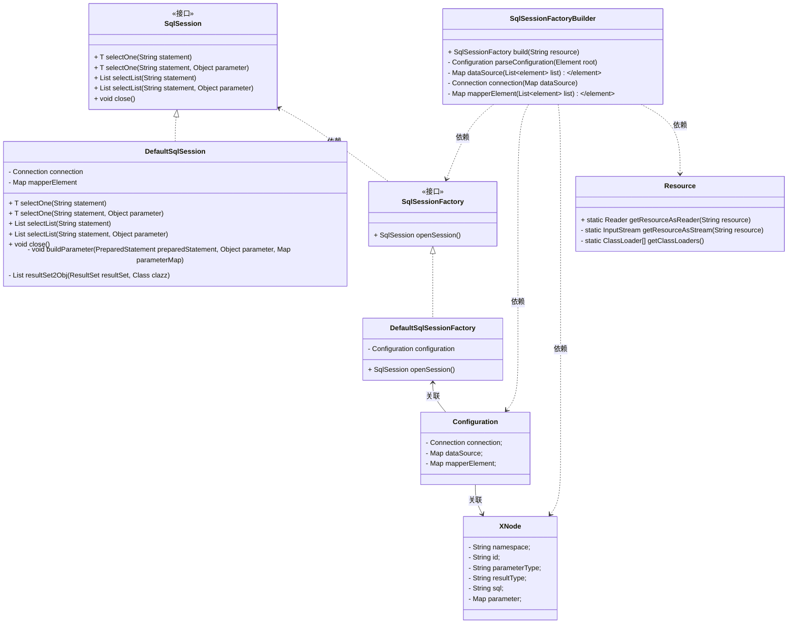

# Spring 中间件
本项目通过实现一些常见的中间件来加深对 Java 开发和 Spring 框架的理解


## 白名单拦截
白名单拦截是我们实际开发中经常遇到的业务场景：一个新功能上线后，我们通常并不会一开始就全量开放给所有用户，而是先给白名单内的用户进行开放使用，等这波用户线上验证完成后再全部开量。在这章我们实现白名单拦截的功能

### 实现思路
白名单拦截的基本实现思路是：自定义注解 + 切面 + 白名单配置
* 自定义注解：用来标记那些需要被拦截的方法。注解中需要有两个属性，第一个表示需要判断的方法参数名，第二个则是被拦截后的返回值
* 切面：用来统一处理拦截逻辑
* 白名单配置：配置白名单列表

### 实现过程
1. 先定义一个自定义注解：`WhiteListAnnotation`，里面包含方法 key，用来表示需要跟白名单进行匹配的参数
2. 然后在配置文件中添加白名单的配置，以 whitelist 作为前缀，并定义配置类：`WhiteListConfiguration`，我们使用注解 `@ConfigurationProperties(prefix = "whitelist")` 来获取配置中的值
3. 通过切面类 `WhiteListProcessAop` 来处理所有的白名单注解，处理逻辑如下：
   * 切入点是所有添加了注解 `WhiteListConfiguration` 的方法
   * 白名单开关关闭时，直接放行
   * 当前方法上没有定义 key 值，则直接放行
   * 当前方法定义了 key 值
     * key 值在白名单中，放行
     * key 值不在白名单中，返回拦截的异常


## 超时熔断
随着现在逐渐微服务化，一个功能可能上下游会依赖几十个服务，而其中如果某个服务挂了的话，那么这条链路可能就全部挂了，进而引起雪崩效应。所以为了能保证服务的高可用，我们需要有个超时熔断的机制，当某个服务不可用时能立马熔断，返回预定的错误

本章实现的超时熔断功能是在 **Netflix** 公司的开源框架 `Hystrix` 的基础上进行的封装，通过注解 + AOP 的方式，使超时熔断更加易于使用。下面简单介绍下 `Hystrix` 的原理与使用

### Hystrix 的原理与使用

maven 依赖包地址如下：
```xml
<dependency>
    <groupId>com.netflix.hystrix</groupId>
    <artifactId>hystrix-core</artifactId>
    <version>1.5.18</version>
</dependency>
```

`Hystrix` 工作时有以下三个状态：
* 关闭：所有请求直接通过
* 全开：当服务错误达到阈值时，进入全开状态，产生熔断，此时所有请求均降级返回
* 半开：处于全开状态下，经过阈值窗口时间后，会先处于半开状态，在本状态下，会放过一个请求，如果请求能正常返回，则后续变为关闭状态，否则回到全开状态


`Hystrix` 的使用主要有命令模式和注解模式两种。下面详细介绍命令模式的使用：

通过继承 `HystrixCommand` 来包裹实际需要调用的服务，在 `run()` 中调用服务，在 `getFallback()` 中实现降级逻辑，并且可以通过以下两种方式执行：
- execute(): 同步执行，直接返回结果，发生错误时抛异常
- queue(): 异步执行，返回一个 `Future` 对象

`HystrixCommand` 支持如下的配置： 
- GroupKey:  该命令属于哪一个组，可以帮助我们更好的组织命令。
- CommandKey: 该命令的名称
- ThreadPoolKey: 该命令所属线程池的名称，同样配置的命令会共享同一线程池，若不配置，会默认使用GroupKey作为线程池名称。
- CommandProperties: 该命令的一些设置，包括断路器的配置，隔离策略，降级设置以及一些监控指标等。
- ThreadPoolProerties: 关于线程池的配置，包括线程池大小，排队队列的大小等。

使用示例见：`HystrixDemo`

### 实现
我们最终的实现效果是通过注解的方式来方便的给当前方法添加超时熔断，可以指定超时时长，也可以使用默认的1s超时熔断。为此，我们分以下步骤实现：

1. 定义超时熔断注解：`HystrixAnnotation`，包含一个参数 timeoutMs，主要用来标记哪些方法需要超时熔断
2. 定义超时熔断处理类 `HystrixProcess`，接收切面类的方法，以及超时熔断时间，并在 run 方法中调用切面方法，完成最终方法的执行。在降级方法中返回熔断异常
3. 定义切面处理类 `HystrixProcessAop`，处理所有有超时注解的方法，实例化上述超时熔断处理类，并将当前的方法以及超时参数传入。注意：在本方法中通过 @Around("pointcut() && @annotation(hystrixAnnotation)") 来直接获取方法中的注解值

**注意点:**

在超时时长的设置中，由于同一个 key 只能设置一次，因此为了能支持对不同方法设置不同时长，我们将 "类名.方法名" 称作为 key 值传入，如下：
```
super(Setter.withGroupKey(HystrixCommandGroupKey.Factory.asKey("ExampleGroup"))
                // 通过 "类名.方法名" 来实现不同方法的超时时长的设置: String commandKey = jp.getTarget().getClass().getName() + "." + jp.getSignature().getName();
                .andCommandKey(HystrixCommandKey.Factory.asKey(commandKey))
                .andCommandPropertiesDefaults(HystrixCommandProperties.Setter()
                        .withExecutionTimeoutInMilliseconds(timeoutMs)));
```


## 服务限流
服务在线上跑的时候，一般都是有性能上限的，比如某个服务 A 最大只能应对 100 QPS 的请求，但如果此时一瞬间有大流量进来，比如有 2000 QPS 的请求进来，那么服务一下子就被打崩溃了

对于上述这种问题，我们一般采用限流的方式来解决，所以本章我们就来实现限流

### 限流算法

常见的限流算法有以下三种：
1. 计数器法
2. 漏桶算法
3. 令牌桶

**计数器法**: 计数器法限流比较简单粗暴，比如我们现在要限流 100QPS/s，那么从接收到第一个请求开始计数，每接收一个请求，计数加 1，当在 1s 内接收到 100 个请求后，后续所有的请求则全部直接丢弃，直到下一个 1s 的到来又开始重新计数
这种方式的缺点是后续的请求会被全部放弃掉，就像一个突刺一样，我们称之为突刺现象

**漏桶算法**：所有请求到来时先进入漏桶中（可以用队列实现桶），然后以指定速率从桶中获取请求来处理。虽然请求到来的时间不确定，但由于处理的速度是确定的，因此也能达到限流的目的，当然在桶装满的情况下，后续的请求也会被丢弃掉。漏桶算法可以有效的解决突刺问题，但缺点是难以应对一开始的大流量问题


**令牌桶**: 令牌桶是在桶中以固定速率放入令牌，然后服务每次先从令牌痛中获取令牌，当获取到时则服务继续运行，如果获取不到则原地等待或者直接返回异常，通过控制令牌放入桶中的速率，可以达到限流的目的。由于令牌痛一开始是装满令牌的，因此可以应对一开始的大流量问题


### 限流实现
本章实现的限流功能是基于 guava 的 `RateLimiter`限流工具的封装，它本身使用令牌桶算法，依赖包地址如下：

```xml
<dependency>
   <groupId>com.google.guava</groupId>
   <artifactId>guava</artifactId>
   <version>18.0</version>
</dependency>
```

`RateLimiter` 的使用很简单，只需要通过 create 方法创建一个实例对象，然后调用 acquire（没有令牌时原地阻塞） 或者 tryAcquire（没有令牌直接返回 false） 方法获取令牌即可，示例如下：

```java
package com.aric.middleware;

import com.google.common.util.concurrent.RateLimiter;

public class RateLimiterDemo {
    //每秒只发出 1 个令牌
    private final RateLimiter rateLimiter = RateLimiter.create(1);

    public void testLimit() {
        int count = 0;
        for (;;) {
            if (rateLimiter.tryAcquire()) {
                System.out.println(System.currentTimeMillis() / 1000);
                count++;
                if (count > 10) {
                    break;
                }
            }
        }
    }

    public static void main(String[] args) {
        RateLimiterDemo rateLimiterDemo = new RateLimiterDemo();
        rateLimiterDemo.testLimit();
    }
}

```

基于上述的 `RateLimiter`，我们现在可以封装自己的限流中间件。具体实现步骤如下：

1. 定义注解类 `RateLimiterAnnotation`，用来给需要添加限流的方法使用，同时包含一个参数 permitPerSecond 来表示具体的限流值
2. 定义限流封装类 `RateLimiterProcess`，实现核心的限流逻辑。
    - 接收切面方法来调用具体的服务
    - 维护一个 map，"类名.方法名" 作为 key，限流对象作为 value，限流参数由注解提供，最终实现针对不同方法具有不同的限流值
3. 定义切面类 `RateLimiterProcessAop`，用来拦截所有有限流注解的方法，并传入上述的限流封装类中

## 自定义拦截方法
本章我们实现自定义拦截方法，通过注解+切面的形式给用户提供更加方便的自定义逻辑的实现。

### 实现
1. 添加注解 `MethodExtAnnotation`，用来表示自定义方法的信息，其中参数 method 表示自定义的方法名称
2. 添加切面类 `MethodExtProcessAop`，处理自定义逻辑：
    * 首先从注解中获取到自定义方法的名称
    * 根据名称获取到自定义方法，这里已经假设自定义方法的参数和当前方法的参数一致：`jp.getTarget().getClass().getMethod(methodName, method.getParameterTypes());`
    * 判断方法返回时是否是 boolean，不是则抛出异常: `method.getReturnType().getName().equals("boolean")`
    * 运行方法，再根据返回值是否为 true 决定继续运行还是直接返回
3. 自定义逻辑使用如下：在运行方法 `queryUser` 时，会先运行方法 `doFilter`，当 `doFilter` 返回为 true 时，则 `queryUser` 正常返回，否则直接返回被拦截异常

```java
import com.aric.middleware.common.Result;

class MethodExtDemo {
   @MethodExtAnnotation(method = "doFilter")
   public Result queryUser(String userId) {
      return Result.success("查询用户: " + userId);
   }

   /**
    * 自定义拦截方法
    */
   public boolean doFilter(String userId) {
      if ("1234".equals(userId)) {
         logger.info("拦截自定义用户 userId：{}", userId);
         return false;
      }
      return true;
   }
}

```

## ORM 框架实现
数据库操作是我们实际业务中经常使用的，我们都用过 JDBC 的方式进行数据库操作，随着后面的学习，我们接触到了 iBatis、MyBatis，Hibernate 等优秀的数据库操作组件，这些都是 ORM 的具体实现。本章我们基于底层的 JDBC 自己封装一套 ORM 框架

### JDBC 介绍
在具体开发前，先来介绍下 JDBC 组件。JDBC 组件是数据库的驱动，提供了对数据库的 CRUD 操作。下面以一个示例来具体说明 JDBC 的使用：

```java
package com.aric.middleware;

import java.sql.Connection;
import java.sql.DriverManager;
import java.sql.PreparedStatement;
import java.sql.ResultSet;

public class JdbcDemo {
    private static final String URL = "jdbc:mysql://localhost:3306/demo";
    private static final String USER = "root";
    private static final String PASSWORD = "";

    public void insertData(String name) {
        String sql = "insert into users(name) values(?)";
        try(
                Connection conn = DriverManager.getConnection(URL, USER, PASSWORD);
                PreparedStatement preparedStatement = conn.prepareStatement(sql);
        ) {
            preparedStatement.setString(1, name);
            preparedStatement.executeUpdate();
            System.out.println("Inserted: " + name);
        } catch (Exception e) {
            e.printStackTrace();
        }
    }

    public void fetchData() {
        String sql = "select * from users;";

        try (
                Connection conn = DriverManager.getConnection(URL, USER, PASSWORD);
                PreparedStatement preparedStatement = conn.prepareStatement(sql);
        ) {
            ResultSet resultSet = preparedStatement.executeQuery();
            System.out.println("fetch data: id  name");
            while (resultSet.next()) {
                int id = resultSet.getInt("id");
                String name = resultSet.getString("name");
                System.out.println(id + ", " + name);
            }

        } catch (Exception e) {
            e.printStackTrace();
        }
    }

    public void updateData(int id, String name) {
        String sql = "update users set name = ? where id = ?";

        try (
                Connection conn = DriverManager.getConnection(URL, USER, PASSWORD);
                PreparedStatement preparedStatement = conn.prepareStatement(sql);
        ) {
            preparedStatement.setString(1, name);
            preparedStatement.setInt(2, id);

            preparedStatement.executeUpdate();
            System.out.println("update for id = " + id + ", name = " + name);
        } catch (Exception e) {
            e.printStackTrace();
        }
    }

    public void deleteData(int id) {
        String sql = "delete from users where id = ?";
        try (
                Connection conn = DriverManager.getConnection(URL, USER, PASSWORD);
                PreparedStatement preparedStatement = conn.prepareStatement(sql);
        ) {
            preparedStatement.setInt(1, id);
            int i = preparedStatement.executeUpdate();
            System.out.println("delete id: " + id + ", result: " + i);
        } catch (Exception e) {
            e.printStackTrace();
        }
    }

    public static void main(String[] args) {
        JdbcDemo jdbcDemo = new JdbcDemo();
        jdbcDemo.insertData("aric");
        jdbcDemo.insertData("xiaoming");
        jdbcDemo.fetchData();
        jdbcDemo.updateData(1, "xiaoli");
        jdbcDemo.deleteData(2);
    }
}

```

通过上述的 CRUD 操作，我们知道使用 JDBC 对数据库进行操作主要分以下 4 步：
1. 连接到数据库：使用 "DriverManager.getConnection" 进行连接，并获取到连接对象 `Connection`
2. 预编译：我们调用 "connection.prepareStatement(sql)" 方法来对 SQL 语句执行预编译，并获取到预编译对象 `PreparedStatement`。执行预编译有很多好处，可以提高重复执行的效率，也可以防止 SQL 注入等
3. 设置参数：如果 SQL 语句中带有参数，那么这时候我们就需要设置参数，常见的方法如下，如果没有参数则不用执行
   * setInt(int parameterIndex, int x)：设置 int 类型参数
   * setString(int parameterIndex, String x)：设置 String 类型参数
   * setDouble(int parameterIndex, double x)：设置 double 类型参数
   * setDate(int parameterIndex, Date x)：设置 Date 类型参数
4. 执行 SQL 语句：有两种 API 来执行语句：
   * executeQuery()：执行查询，返回 ResultSet
   * executeUpdate()：用于执行 DML 语句（如 INSERT、UPDATE、DELETE），返回更新的行数

对于数据库执行返回的结果对象 `ResultSet` 是一个可以遍历的对象，允许我们逐行读取结果集中的数据

通常，我们先使用 next() 方法来移动到结果集中的下一行，返回 true 如果有下一行，返回 false 如果到达结果集的末尾

然后我们使用下面的 API 来访问列数据：
* getString(int columnIndex)：根据列的索引获取字符串类型的数据。
* getInt(String columnName)：根据列名获取整型数据。
* getDouble(int columnIndex)：根据列索引获取双精度浮点数。
* getDate(String columnLabel)：根据列名获取日期数据。

### ORM 整体设计

整个 ORM 框架需要包含以下几部分：
* xml 配置文件的解析，节点信息的保存
* 数据库的连接操作
* SQL 语句的解析执行和结果映射

上述功能中数据库的连接，SQL 语句的解析和执行我们使用 JDBC 的 API 实现，其余部分都需要我们自己实现。我们根据上述的功能进行合理划分，得到下面的类和接口：
* `Resource`、`XNode` 和 `Configuration`：分别表示资源类、xml 的节点类以及配置类
* `SqlSession` 和 `DefaultSqlSession`：接口和实现类，用来实现 SQL 的解析、执行和结果映射
* `SqlSessionFactory` 和 `DefaultSqlSessionFactory`：接口和实现类，用来实现数据库的连接操作
* `SqlSessionFactoryBuilder`：实现读取配置，解析并构造需要的类

#### 类整体设计



#### 关键步骤的实现
**xml 配置文件读取**

我们通过 `Resource` 类来实现资源的读取，具体是通过 `ClassLoader` 来加载字节流 `InputStream`，然后再转换为方便读取的字符流 `InputStreamReader`，如下:
```java
// 通过 ClassLoader 加载字节流
InputStream inputStream = classLoader.getResourceAsStream(resource);

// 字节流转换为字符流
Reader reader = new InputStreamReader(inputStream);
```

**xml 配置文件解析**

我们借助工具 dom4j 来实现对 xml 文件的解析：
1. 先从上一步中获取到的字符流 `Reader` 创建对象 `SAXReader`
2. 创建文档对象 `Document`
3. 从文档对象获取到根节点 `Element`
4. 在根节点上获取我们感兴趣的节点，使用方法 "selectNodes(nodeName)" 即可，我们也可以在节点名前增加 "//" 来直接选择子孙节点: "selectNodes("//nodeName")"
5. 通过 "content()" 方法获取到当前节点的所有子节点
6. 通过 "attributeValue(name)" 获取当前节点的属性

```java
import javax.swing.text.Element;

Reader reader = Resources.getResourceAsReader(resource);

SAXReader saxReader = new SAXReader();

Document document = saxReader.read(new InputSource(reader));

Element root = document.getRootElement();

List<Element> nodes = root.selectNodes("mappers");

List nodeChildren = nodes.get(0).content();

String id = (Element)(nodeChildren.get(0)).attributeValue("id");

String text = (Element)(nodeChildren.get(0)).getText(); // 获取节点的 text 内容
```

**XNode 节点的解析**

XNode 节点存储了我们需要的所有的 SQL 相关的信息，包括 sql 语句，输入参数，输出类型等，一个实际的例子如下：
```xml
 <select id="queryUserInfoById" parameterType="java.lang.Long" resultType="com.aric.middleware.mybatis.po.User">
     SELECT id, userId, userNickName, userHead, userPassword, createTime
     FROM user
     where id = #{id}
 </select>
```

为了存储上述的信息，XNode 类中定义了如下属性：
* String namespace: 命名空间，用来区分不同的配置文件
* String id: 当前 sql 语句的唯一标识，结合上述的 namespace，可以作为全局唯一标识: "namespace.id"
* String parameterType: 表示参数类型，一般如果只有一个参数，则可以直接使用简单对象 Long、String 等，如果 sql 中有多个参数，则使用对象或者 Map 类型的数据，存放不同的类型
* String resultType: sql 执行返回的结果类型
* String sql: 具体的 sql 语句
* Map<Integer, String> parameter: 存放 sql 中需要的参数

下面重点讲述 sql 语句的参数的解析。为了能支持参数，我们这里以特殊符号 "#{}" 来表示参数，通过正则表达式来解析出 sql 语句中的参数，并将参数名保存至 map 接口中, index 作为 map 的 key，因为在 JDBC 中参数的设置也是以 index 作为 key 值，同时当前的参数替换为 "?"，处理后，当前的 SQL 语句就是标准的 JDBC 可以解析的了。如下：
```java
public class Demo {
    public void parse() {
       String sql = node.getText();
       Map<Integer, String> parameter = new HashMap<>();
       Pattern pattern = Pattern.compile("(#\\{(.*?)})");
       Matcher matcher = pattern.match(sql);
       for (int i = 1; matcher.find(); i++) {
          String g1 = matcher.group(1);
          String g2 = matcher.group(2);
          // 保存参数到 map 中, 其中 i 作为 key，这样可以和 jdbc 中的 sql 参数一一对应
          parameter.put(i, g2);

          // 将自定义的参数类型 #{id} 替换为 JDBC 能处理的类型 ?
          sql = sql.replace(g1, "?");
       }
    }
}
```

**DefaultSqlSession 中的 buildParameter(PreparedStatement preparedStatement, Object parameter, Map<Integer, String> parameterMap) 实现**

"buildParameter" 方法是用来完成 SQL 中变量的替换的。实现方式也比较简单：
1. 如果输入对象 parameter 是普通的对象：Short、Integer、Long、String、Date，则直接调用 PreparedStatement 对象的 setShort、setLong 等方法进行参数替换
2. 如果输入对象 parameter 是复杂对象是，先利用反射获取到输入对象的所有字段的值，并保存到 map 中
3. 然后遍历参数列表 parameterMap，根据参数名从上述的 map 中获取到对应的参数值，然后再根据参数值的类型去调用第一步中的对应 API 进行参数的替换

至此就完成了对 SQL 参数的替换

**DefaultSqlSession 中的 resultSet2Obj(ResultSet resultSet, Class<?> clazz) 实现**

"resultSet2Obj" 方法是将数据库查询结果转换为我们需要的对象类型。核心是遍历查询结果集，通过反射的方式将数据库中的结果映射到对象中，具体实现如下：
1. 先获取数据库结果的相关信息 `ResultSetMetaData`，从中获取到返回的列数量等信息
2. 从结果集 resultSet 中获取到当前列的值，并且通过列名拼接出对应对象的方法名，比如列名称为 "id"，则拼接出对象的方法名 "setId"
3. 根据上述的方法名，从对象上获取到实际的方法，然后调用方法实现值的设置，如下：
   ```
   // 获取数据库结果信息
   ResultSetMetaData metaData = resultSet.getMetaData();
   
   // 创建一个对象
   (T) obj = (T) clazz.newInstance();
   
   // 获取到数据库列名
   String columnName = metaData.getColumnName(i);

   // 获取到当前数据库列的值
   Object value = resultSet.getObject(i);
   
   // 拼接方法名
   String methodName = "set" + columnName.substring(0, 1).toUpperCase() + columnName.substring(1); 
   
   // 通过反射获取到方法
   if (value instanceof Timestamp) {
     Method method = clazz.getMethod(methodName, Date.class); 
   } else {
     Method method = clazz.getMethod(methodName, value.getClass()); 
   }
   
   // 调用方法设置值
   method.invoke(obj, value);
   ```

